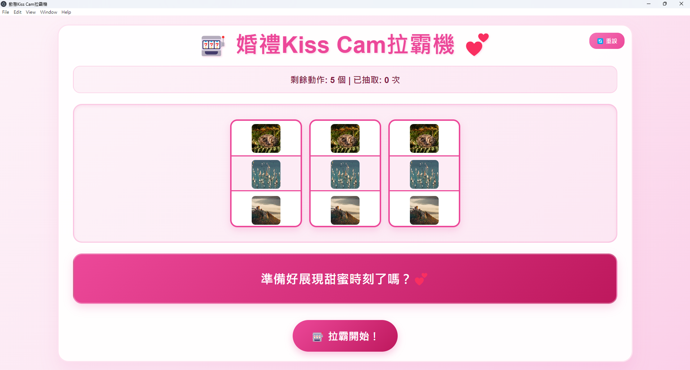

**English Version** | [中文說明](README.md)

# Kiss Cam Slot Machine (English)

This is an interactive slot machine game designed for weddings, allowing guests to draw sweet actions and add fun to the event.  💕
The main interface is generated by Canva AI, and interactive features are modularized with Copilot.

🎉 **Try It**
👉 [Let's Go](https://tony8382.github.io/kiss-cam/static/)  


## Customization

Edit `config.txt` to set the game title and actions. Each action can be paired with an image (placed in the `images/` folder).

### Config Example
- `title`: Game title
- `actionX`: Action name and image filename (comma separated)

---

## Web Version (static)

1. Go to the static folder:
   ```
   cd static
   ```
2. Install dependencies:
   ```
   npm install
   ```
3. Start the web version:
   ```
   npm start
   ```
4. Open your browser and go to http://localhost:xxxx

---

## Electron Version

1. Go to the electron-app folder:
   ```
   cd electron-app
   ```
2. Package for Windows:
   ```
   npx electron-packager . kiss-cam-app --platform=win32 --arch=x64 --out=dist --overwrite
   ```
3. After packaging, you will find `kiss-cam-app.exe` in `dist/kiss-cam-app-win32-x64`.

### config.txt and images folder location
- Place `config.txt` and the `images` folder in the `electron-app` directory.
- The app will automatically read `electron-app/config.txt` and `electron-app/images/`.

---
## Design workflow:
1. Main interface generated by Canva AI.
2. Interactive features and modularization by Copilot.
3. Easily converted to Electron desktop version for Windows packaging.
